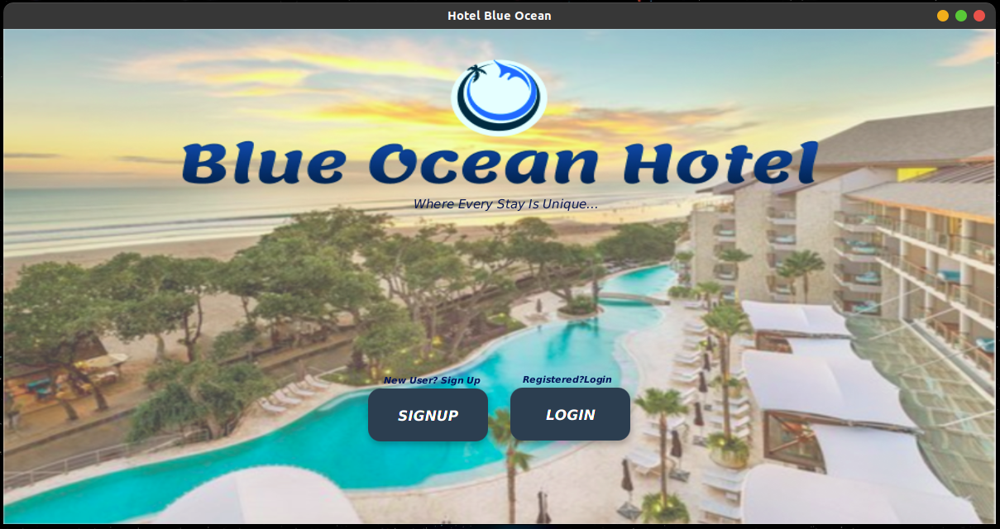
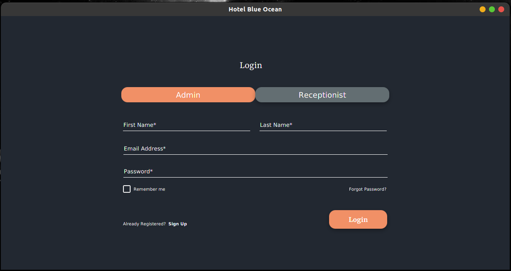
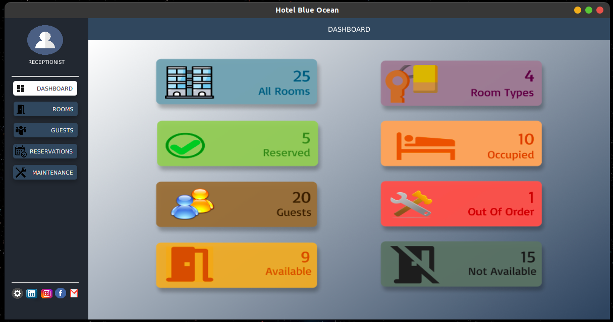
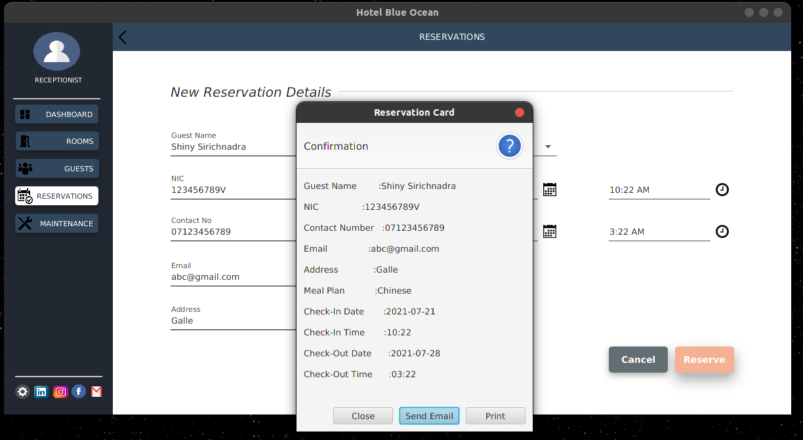
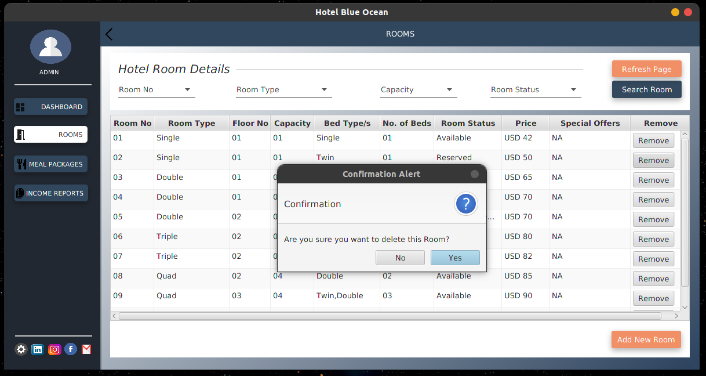
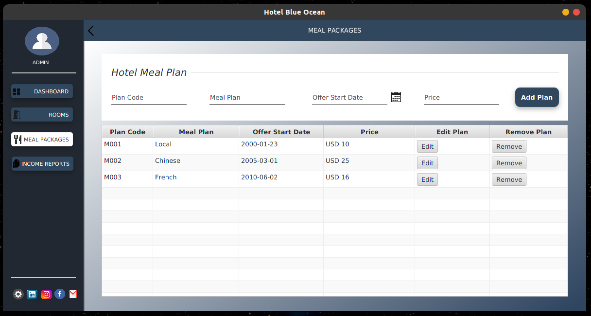

# Room Reservation System

Standalone Application using JavaFX (2021 July).

This was implemented mainly to get an approach to develop standalone applications using Java.

## Objectives :

- Usage of Java, JavaFX for application development.
- Ability to create standard user interfaces for standalone applications.
- Usage of Event Handling.

 

#

 

  
  
  
  
  
  
